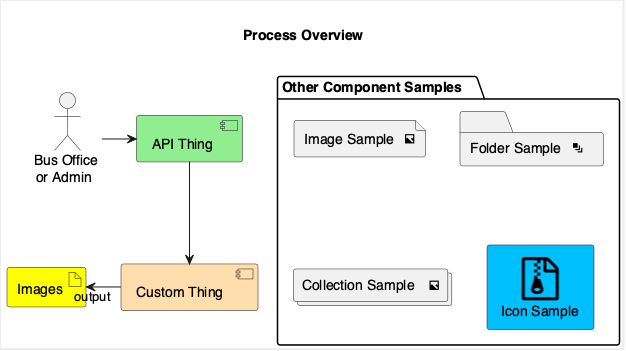
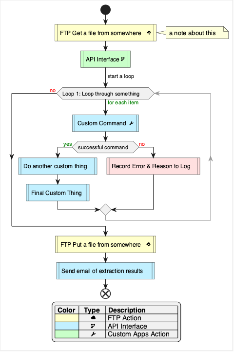

# Program Description

```{r results='hide', out.width=0}
file_name <- "images/process_overview.png"
x <- plantuml('
\' Cheatsheet - https://blog.anoff.io/puml-cheatsheet.pdf
\' Font Icons with iconic: https://useiconic.com/open/
\' --- For advanced imaging use sprites ---
\' https://github.com/tupadr3/plantuml-icon-font-sprites
\' https://github.com/plantuml/plantuml-stdlib

!define ICONURL https://raw.githubusercontent.com/tupadr3/plantuml-icon-font-sprites/v2.4.0

!includeurl ICONURL/common.puml
!includeurl ICONURL/font-awesome/file_zip_o.puml

title \\nProcess Overview\\n

actor "Bus Office\\nor Admin" as user
component [API Thing] as api #lightgreen
component [Custom Thing] as cs #navajowhite
artifact "Images" as img #yellow

user --right--> api
api   -down->  cs
cs   -left-> img : \toutput

package "Other Component Samples" {
  file "Image Sample <&image>" as file_sample
  folder "Folder Sample <&layers>" as folder_sample
  collections "Collection Sample <&image>" as collection_sample
  FA_FILE_ZIP_O(ic_sample,Icon Sample,rectangle,black) #DeepSkyBlue
}

skinparam defaultTextAlignment center
skinparam BackgroundColor #ffffff
skinparam legendBackgroundColor 00FF0067
skinparam linetype polyline
skinparam linetype ortho

skinparam Diagram {
  BorderColor #ededed
  BorderThickness 2
}
')
plot(x = x, file = file_name)
```



## Daily Process

### PlantUML Style

```{r results='hide', out.width=0}
file_name <- "images/process_flowchart.png"
x <- plantuml('
\' Cheatsheet - https://blog.anoff.io/puml-cheatsheet.pdf
\' Font Icons with iconic: https://useiconic.com/open/
\' --- For advanced imaging use sprites ---
\' https://github.com/tupadr3/plantuml-icon-font-sprites
\' https://github.com/plantuml/plantuml-stdlib

!define ICONURL https://raw.githubusercontent.com/tupadr3/plantuml-icon-font-sprites/v2.4.0

!includeurl ICONURL/common.puml
!includeurl ICONURL/font-awesome/file_zip_o.puml

start

#Business:FTP Get a file from somewhere<&cloud-download>|
note right
a note about this
end note

#Technology:API Interface<&fork>|
->start a loop;
while (Loop 1: Loop through something) is (<color:green>for each item)
  #Application:Custom Command<&wrench>|
  if (successful command) then (<color:green>yes)
    #Application:Do another custom thing|
    #Application:Final Custom Thing|
  else (<color:red>no)
    #Implementation:Record Error & Reason to Log|
  endif
  -[#999]->
  \' -[#999,dotted]->
  \' -[#999,dashed]->
endwhile (<color:red>no)

#Business:FTP Put a file from somewhere<&cloud-upload>|
#Application:Send email of extraction results|
end

legend
|= Color |=  Type  |= Description |
|<#Business>|      <&cloud> | FTP Action |
|<#Application>|      <&fork> | API Interface |
|<#Technology>|      <&wrench> | Custom Apps Action |
endlegend

skinparam defaultTextAlignment center
skinparam BackgroundColor #ffffff
skinparam legendBackgroundColor #f1f1f1
skinparam linetype polyline
skinparam linetype ortho

skinparam Diagram {
  BorderColor #ededed
  BorderThickness 2
}
')
plot(x = x, file = file_name)
```



### Mermaid Style

```{r echo=FALSE}
DiagrammeR::mermaid("
%%{init: {'themeVariables': { 'edgeLabelBackground': 'white'}}}%%
flowchart TD
  classDef default fill:#f1f1f1,stroke:#333;
  classDef hide fill:#0000,stroke:#0000,stroke-width:0px,color:#0000;
  classDef FtpCommand fill:#ffffcc,stroke:#333;
  classDef DmCommand fill:#c9ffc9,stroke:#333;
  classDef CustomCommand fill:#c2f0ff,stroke:#333;
  classDef Error fill:#ffe0e0,stroke:#333;
  
  ftp[FTP Get a file from somewhere fa:fa-cloud-download]:::FtpCommand --> dm[API Interface fa:fa-share-alt]:::DmCommand
  dm --> loop(Loop through something)
  loop -->|First Item| cust[<center>Custom <br> Command fa:fa-wrench</center>]
  cust --> check{<center>Successful <br> Command?</center>}
  check -->|Yes| cust2[Do another custom thing]
  cust2 --> cust3[Final Custom Thing]
  check -->|No| err[Record Error & Reason to Log]:::Error
  cust3 --> loop_stop(( ))
  err --> loop_stop
  loop_stop --> |Next Item| loop
  loop_stop --> put[FTP Put a file somewhere fa:fa-cloud-upload]:::FtpCommand
  put --> e[Send email of extraction results]:::CustomCommand

  e --- Legend
  subgraph Legend
    direction LR
    desc_ftp[FTP Action fa:fa-cloud]:::FtpCommand --- desc_dm[API Interface fa:fa-share-alt]:::DmCommand
    desc_dm --- desc_cst[<center>Custom Apps <br> Action fa:fa-wrench</center>]:::CustomCommand
  end
  classDef hideline fill:#ffe0e0,stroke:#333
  linkStyle 12,13,14 stroke:#0000,stroke-width:0px;
 
  class cust,cust2,cust3 CustomCommand
", height="900px", width='auto')
```

## Database Schema

```{r results='hide', out.width=0}
file_name <- "images/db_schema.png"
x <- plantuml('
!define table(x) class x << (T,#FFAAAA) >>
!define primary_key(x) <b><u>x</u></b>
!define indexed(x) <color:OrangeRed>x</color>
!define unique(x) <color:green>x</color>
!define not_null(x) <u>x</u>

hide methods
hide stereotypes

title \\nDB Diagram Sample\\n

table(people) {
  + primary_key(id) NUMBER
  not_null(name) VARCHAR
}

table(posts) {
  + primary_key(id) NUMBER
  indexed(person_id) NUMBER
  indexed(title) VARCHAR
  contents TEXT
  unique(mnemonic) VARCHAR
}

frame "Circular Reference" {
  table(folders) {
    + primary_key(id) NUMBER
    ----
    not_null(name) VARCHAR
  }
}

people  \"1\" -right- \"*\" posts
folders \"1\" -right- \"*\" folders

skinparam FrameBackgroundColor lightgray
skinparam Diagram {
  BorderColor #ededed
  BorderThickness 2
}
')
plot(x = x, file = file_name)
```


<div style="page-break-before:always;"></div>
\pagebreak
